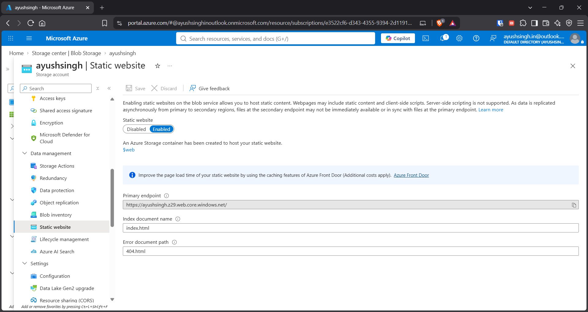
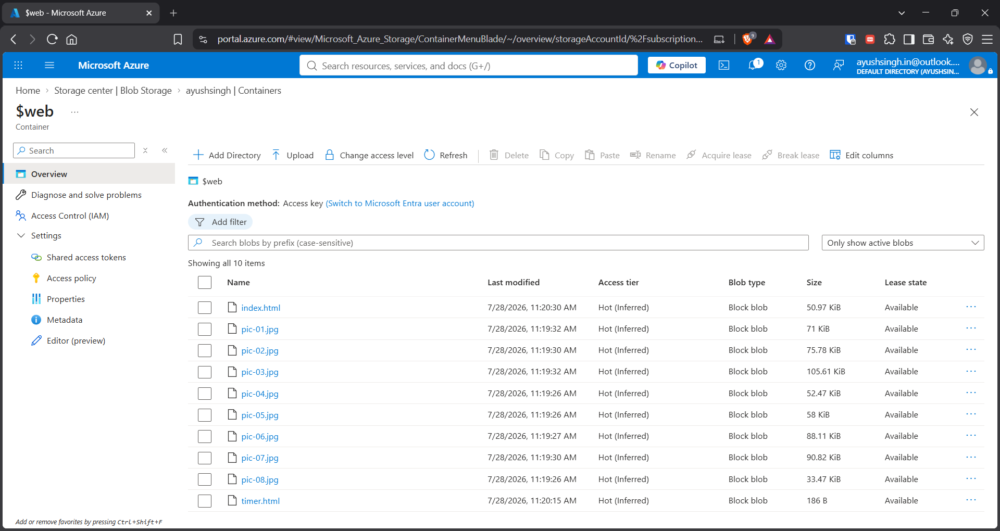
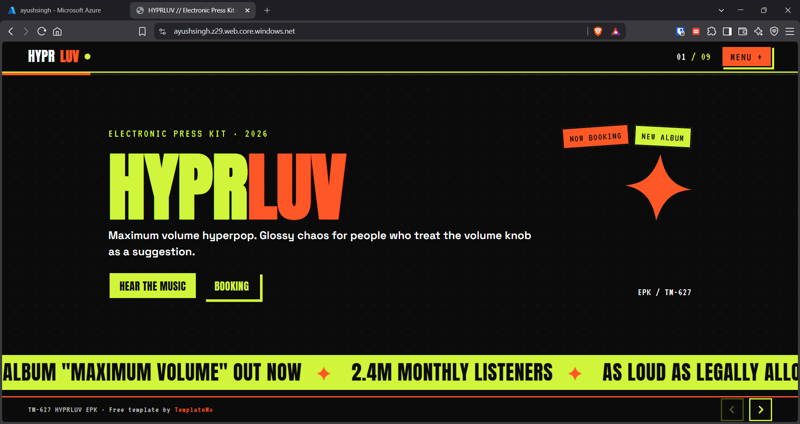

## Overview

Hosted a **static website using Azure Blob Storage Static Website Hosting**.

## Tasks Completed

### 1. Enabled Static Website

- Opened the Azure Storage Account.
    
- Enabled **Static Website** under the Data Management settings.
    
- Configured the index document and error document.
    

---

### 2. Uploaded Website Files

- Created a basic static website using HTML/CSS.
    
- Uploaded the website files to the `$web` container.
    

---

### 3. Tested Website

- Accessed the generated **Static Website endpoint**.
    
- Verified that the website was publicly accessible.
    

## Key Outcome

Successfully hosted a **static website using Azure Storage**, without requiring a virtual machine or web server.