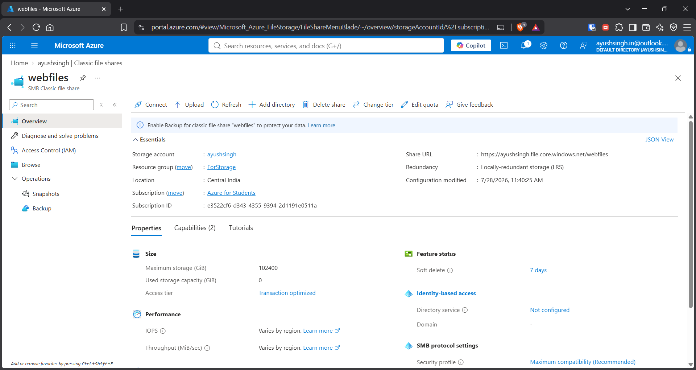
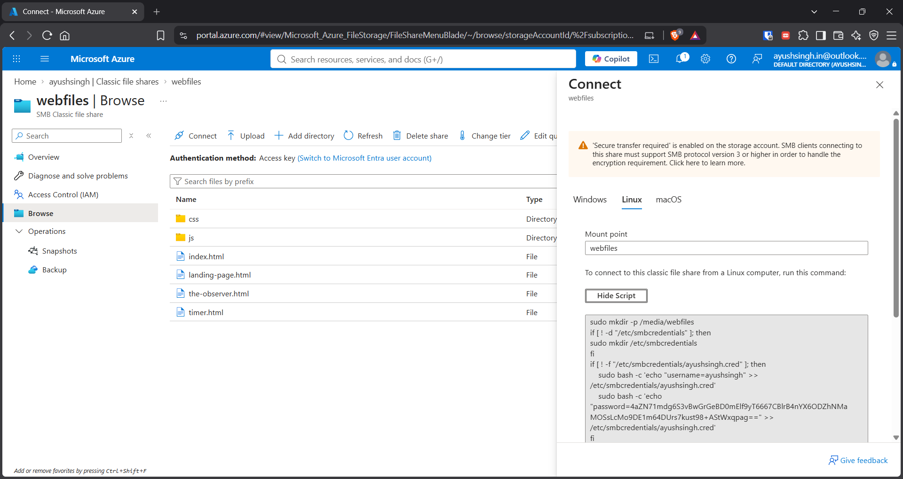
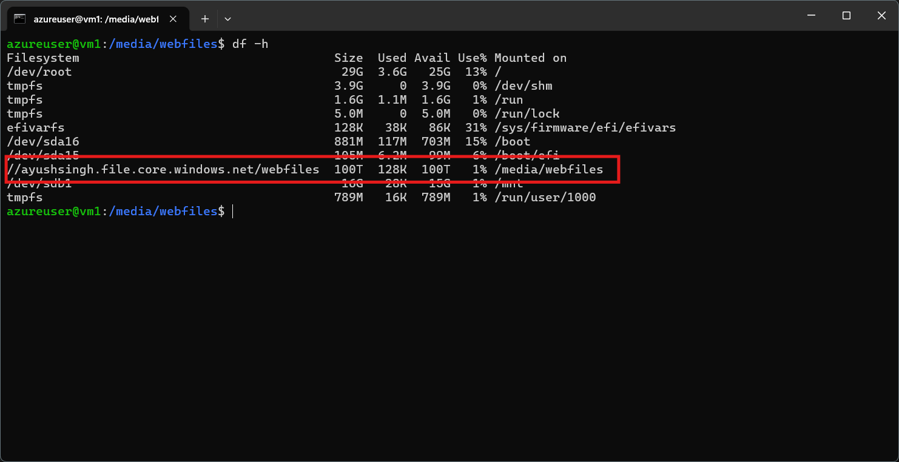
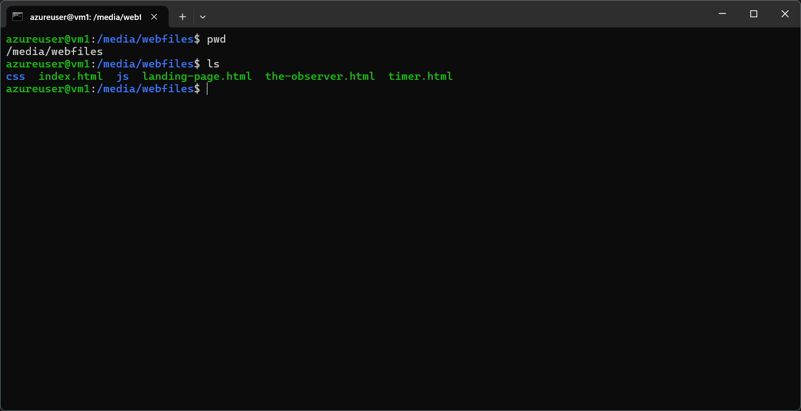
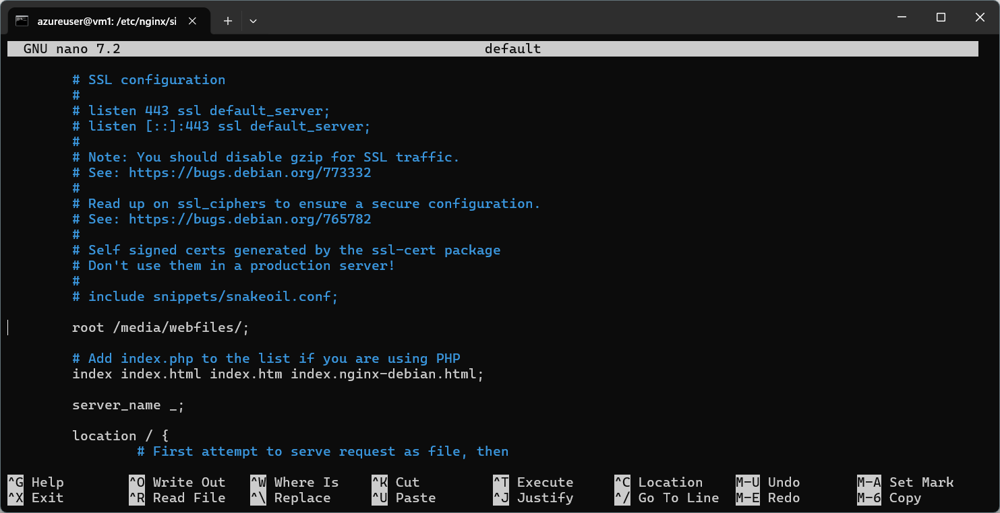
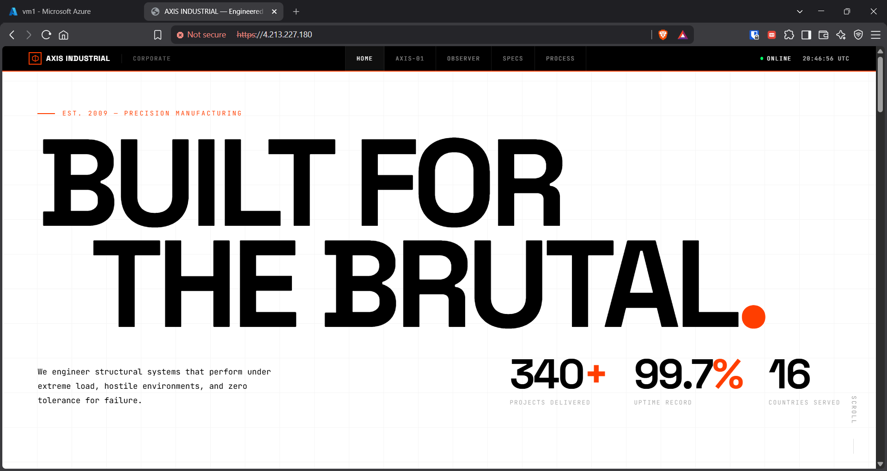

## Overview

Created an **Azure File Share**, mounted it on an **Ubuntu Linux VM**, and used the mounted storage as the location for hosting a website through **Nginx**.

## Tasks Completed

### 1. Created Azure File Share

- Created an Azure Storage Account.
    
- Created an Azure File Share.
    
- Created/uploaded the required website files.

![[Pasted image 20260813025238.png]]

---

### 2. Mounted File Share on Linux VM

- Connected to the Ubuntu VM using SSH.
    
- Configured the required packages and mount settings.
    
- Mounted the Azure File Share to a directory on the Linux VM using the script provided by azure.
    
- Verified that the File Share was accessible from the VM.
    

  

---

### 3. Hosted Website Using Mounted Storage

- Configured **Nginx** on the Ubuntu VM.
    
- Used the mounted Azure File Share as the website directory.
    
- Placed the website files in the mounted storage.
    
- Configured Nginx to serve the website.
    
- Accessed the website through the VM's public IP.
    

📸 **Screenshots:**

- Nginx configuration
    
- Website running in browser
    

---

## Key Outcome

Successfully integrated **Azure File Share with a Linux VM** and used cloud-based shared storage as the backend storage for an **Nginx-hosted website**.
