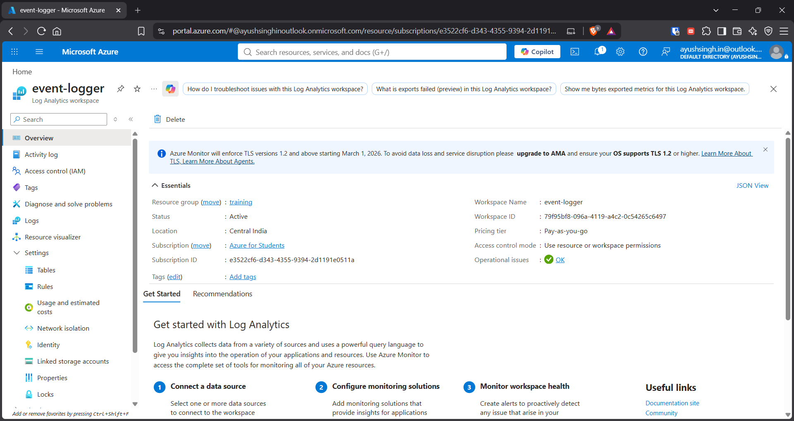

## Overview

Created an **Azure Log Analytics Workspace** and connected Azure resources to collect and analyze monitoring data centrally.

## Tasks Completed

### 1. Created Log Analytics Workspace

- Created a Log Analytics Workspace in Azure.
    
- Configured the required subscription, resource group, and region.
    
- Verified the workspace was active.
    

---

### 2. Connected Azure Resources

- Connected Azure resources to the Log Analytics Workspace.
    
- Configured diagnostic/monitoring data to be sent to the workspace.
    
- Verified that the connected resources were reporting data.
    

📸 **Screenshots:**

- Resource monitoring configuration
    
- Connected resource/data collection
    

---

### 3. Explored Logs

- Opened **Logs** in the Log Analytics Workspace.
    
- Explored incoming monitoring data.
    
- Used the workspace as a centralized location for resource logs.
    

📸 **Screenshot:** Log Analytics Logs interface

## Key Outcome

Gained hands-on experience with **Log Analytics Workspace creation, resource integration, centralized log collection, and basic log exploration**.